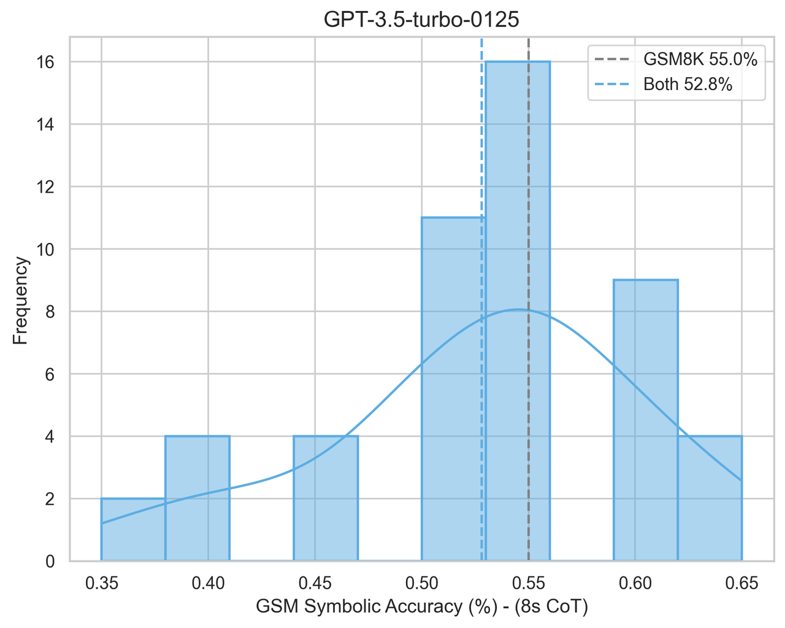
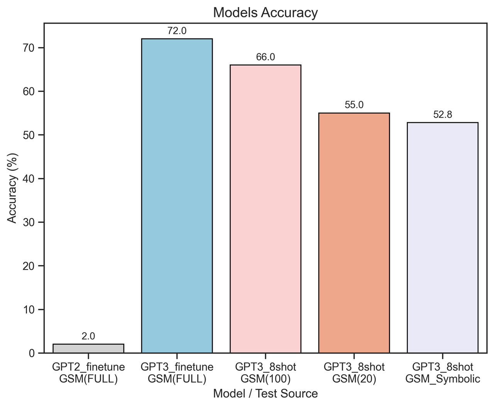

# GSM-Symbolic复现

**GSM-Symbolic 复现项目说明**

**一、项目背景**

随着大语言模型（LLMs）的不断发展，其在数学推理能力方面的表现备受关注。GSM8K 基准常用于评估模型在小学数学水平问题上的推理能力，但现有评估存在局限性，如不清楚模型数学推理能力是否真正提升以及报告指标的可靠性等问题。为解决这些问题，本文作者开展了大规模研究，并引入 GSM-Symbolic 这一改进的基准，本项目对其进行了复现。原文网址：https://machinelearning.apple.com/research/gsm-symbolic

**二、项目内容**

**（一）GSM-Symbolic 基准介绍**

GSM-Symbolic 是从符号模板创建的改进基准，可生成多样化的问题集，从而实现更可控的评估，为衡量模型推理能力提供更可靠的指标。

**（二）复现研究发现**

LLMs 在回答同一问题的不同实例时表现出明显差异。在 GSM-Symbolic 基准中，仅改变问题中的数值时，所有模型的性能均下降。

随着问题中从句数量的增加，模型性能显著下降。即使添加看似与问题相关但不参与最终答案推理链的单个从句，也会导致所有最先进模型的性能大幅下降（高达 65%）。

**三、数据集**

在本项目复现前，原数据文件并没有发布，所以采用的是手写生成数据集，可用Template_test.py（其中一个问题的模板）来生成。**不过现在原文发布了源数据集，可以直接使用**

**四、复现方法与步骤**

**（一）准备工作**

确保已安装必要的依赖库和工具，如 Python 环境、相关的深度学习框架（如 PyTorch 或 TensorFlow）等。

从 Github 或 HuggingFace 下载所需的数据集。

**（二）模型训练与评估**

本次复现采用的模型是GPT3.5（调用的是OPENAI的API）。

test_GPT3_xxx.py: 微调过后或未微调的GPT3.5模型进行测试的代码。

to_message.py: 把原始GSM8K的数据转换成GPT可识别的message数据。注意：不同模型微调所需要的原始文件格式不一定是一样的。

Format_validation.py: message文件格式验证，参考openai官方文件说明。

extract_number.py: 用于提取模型回复的数字答案。

files_openai.py: 将微调数据上传至openai，让openai进行微调，之后可以直接调用API。

draw_xxx.py: 绘图文件。

**五、复现结果**

经过复现，成功观察到与论文中类似的结果，即模型在处理同一问题不同实例和不同从句数量问题时的性能变化趋势与论文一致，证明了复现的有效性。

 

**六、总结与展望**

**（一）总结**

本项目成功复现了 GSM-Symbolic 相关研究，进一步验证了大语言模型在数学推理方面的局限性，如对问题数值变化的敏感性和推理过程的脆弱性。

**（二）展望**

未来可以在此基础上，进一步探索改进模型数学推理能力的方法，或者对其他类似的模型评估基准进行研究和复现，以更深入地理解大语言模型的能力与局限。
